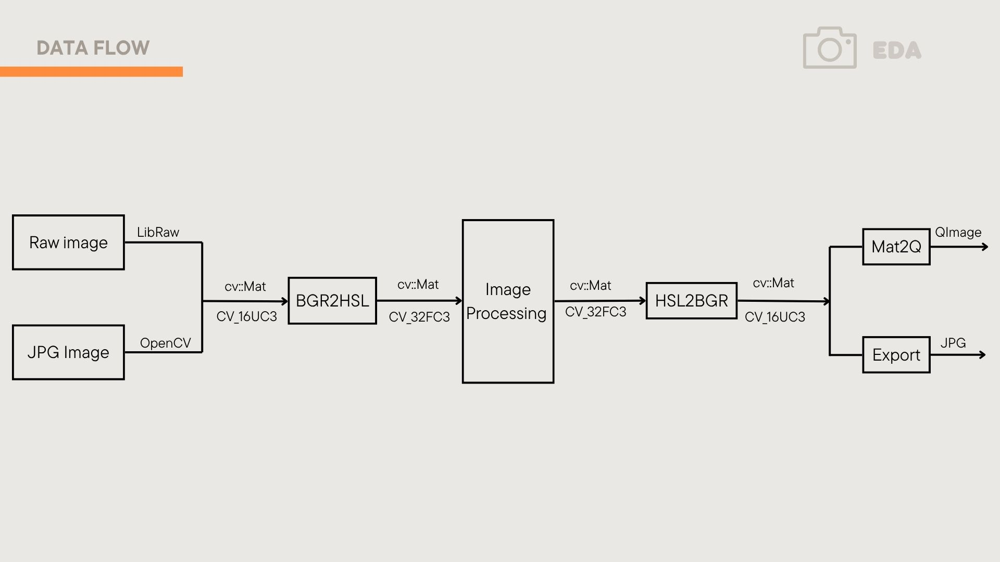
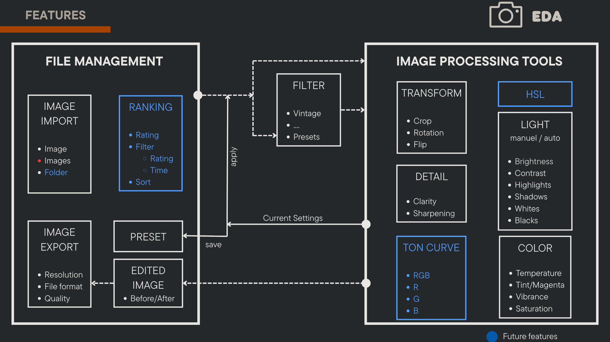
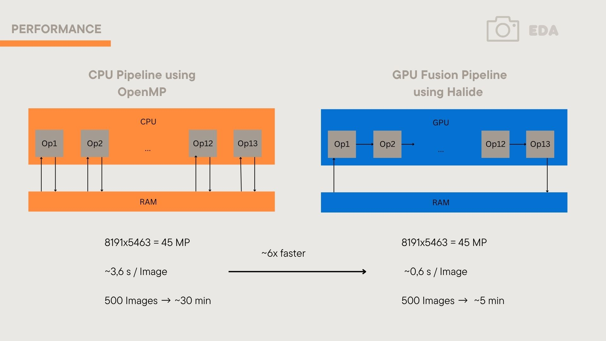
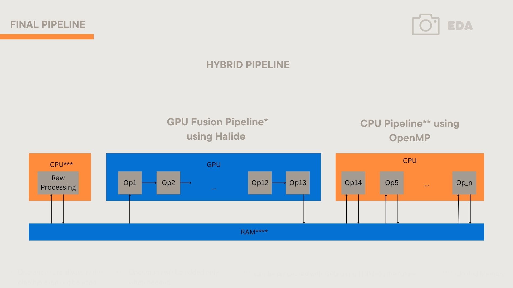

## 🏆 About the Project

This project was created as part of the course **Desktop Application Development** (*Entwicklung Desktop Applikationen*), taught by [Prof. Dr. Jan Salmen](https://www.th-koeln.de/personen/jan.salmen/) at Cologne University of Applied Sciences - [Institut für Medien- und Phototechnik](https://www.th-koeln.de/informations-medien-und-elektrotechnik/institut-fuer-medien--und-phototechnik-imp_14807.php) in cooperation with the [Qt Group](https://www.qt.io/). 

🌟 **Photo Manufactura was voted the best application in the course!**

📰 Read the official feature article on the Qt Blog:  
[From Classroom to Code II: Innovative Qt Apps by Future Developers](https://www.qt.io/blog/from-classroom-to-code-ii-innovative-qt-apps-by-future-developers?hs_preview=OXwMQbmY-395764106431)


# 📸 Photo Manufactura

> **High-performance, modular photo processing engine built with modern C++20 and Qt6**

[](https://cmake.org/)
[](https://isocpp.org/)
[](https://www.qt.io/)
[](https://opencv.org/)
[](https://github.com/LibRaw/LibRaw)
[](https://www.openmp.org/)
[](https://halide-lang.org/)
[](LICENSE)


## ⬇️ Download the App
[](https://github.com/blendezu/photo-manufactura/releases/download/v0.2.0/PhotoManufactura-0.2.0-macOS.dmg)

## 🤝 Team & Contributions

| Contributor | Focus Areas |
| :--- | :--- |
| **Ghiri** |  Project & Software Architecture, GUI Development |
| **Anh Duong** |Software Features, Image Processing, Performance Optimization |

## 🎥 Video Demo v2

https://github.com/user-attachments/assets/dae3756a-edfe-4394-bdd9-75fcd702bd13


## 🖼️ Visual Overview

### ⚙️ Data Flow Architecture


### 💡 Features


### 📊 GPU vs CPU Performance


### 🚀 Processing Pipeline


## 🚀 Quick Start


### Prerequisites
- **CMake 3.21+**
- **C++20 compatible compiler** (GCC 10+, Clang 12+, MSVC 2019+)
- **Qt6** (GUI components)
- **OpenCV** (advanced image processing)
- **LibRaw** (RAW file support)
- **OpenMP** (multithreading support)
- **Halide** (high-performance image processing)

### Installation

```bash
# Clone the repository
git clone https://github.com/blendezu/photo-manufactura.git
cd photo-manufactura

# Build and run
cmake --preset default
cmake --build --preset default
./build/default/bin/photo_manufactura
```

> 📖 **Detailed build instructions**: See [docs/BUILD.md](docs/BUILD.md)

## 📁 Project Structure

```
## 📁 Project Structure

```text
photo-manufactura/
├── 📄 BUILD.md                    # Detailed build instructions
├── ⚙️  CMakeLists.txt              # Main CMake configuration
├── 🔧 CMakePresets.json           # Build presets (default, debug, dev)
├── 📋 conan.txt                   # Package dependencies
├── 📜 LICENSE                     # Project license
├── 📖 README.md                   # This file
├── 🔨 build/                      # Build outputs (generated)
└── 📦 src/                        # Source code
    ├── 🎮 controller/             # UI Logic, Wiring & Commands
    ├── 🎨 image_processing/       # Core filters, style transfer & operations
    ├── 📄 model/                  # AppState, DocumentManager & Settings
    ├── 📸 raw_processing/         # LibRaw integration & RAW handling
    ├── ⚡ tasks/                  # TaskScheduler & Asynchronous processing
    ├── 🖼️  ui/                     # Qt6-based GUI (widgets, canvas, panels)
    └── 🚀 main.cpp                # Application entry point
```

### 🏗️ Architecture Overview

**Modular Design**: Each component in `src/` is built as an independent library:

| Component | Purpose | Key Features |
|-----------|---------|-------------|
| **UI** | Presentation layer | Qt6 widgets, Custom Canvas, Responsive Panels |
| **Controller** | Application Logic | Command Pattern, Application Wiring, Event Handling |
| **Model** | Data & State Management | Document Management, App State, Preset System |
| **Image Processing** | Core algorithms | OpenCV filters, Style Transfer, Halide ops |
| **RAW Processing** | Professional RAW handling | LibRaw support, RAW development |
| **Tasks** | Performance & Async | Multi-threaded Task Scheduler, Async worker system |

### Component Independence
Each component can be developed and built independently to ensure a clean separation of concerns.

```bash
cd src/ui
cmake -B build -S . && cmake --build build
./build/bin/ui_test
```

## 🎯 Use Cases

### Professional Photography Editing

- **RAW Workflow**: Import, process, and export professional RAW files
- **Color Management**: Professional color space handling and calibration
- **Filter Library**: Extensive collection of image filters and effects
- **Basic Editing Tools**: Crop, rotate, adjust brightness/contrast
  

## 🛠️ Development

### Build Configurations

| Preset | Purpose | Optimization | Output |
|--------|---------|-------------|---------|
| `default` | Standard release build | `-O3` | `build/default/` |
| `debug` | Development with symbols | `-g -O0` | `build/debug/` |
| `dev` | Debug + extra warnings | `-Wall -Wextra` | `build/dev/` |

### Code Quality
- **Modern C++20** features and best practices
- **Automatic formatting** with clang-format
- **Static analysis** integration
- **Comprehensive testing** with independent component tests

### Contributing
1. **Create** a feature branch (`git checkout -b feature/amazing-feature`)
2. **Commit** your changes (`git commit -m '<prefix> : Add amazing feature'`) with `feat`, `fix`, or `docs` prefixes
3. **Push** to the branch (`git push origin feature/amazing-feature`)
4. **Open** a Pull Request
5. **Review** and discuss changes with maintainers
6. **Merge** after approval and passing tests
7. **Celebrate** your contribution to Photo Manufactura! 

## 🤝 Community & Support

- **📖 Documentation**: [Build Guide](docs/BUILD.md) | [API Reference](docs/)
- **🐛 Issues**: [GitHub Issues](https://github.com/blendezu/photo-manufactura/issues)
- **💬 Discussions**: [GitHub Discussions](https://github.com/blendezu/photo-manufactura/discussions)


## 📄 License

This project is licensed under the GNU General Public License v3.0 - see the [LICENSE](LICENSE) file for details.


---

<div align="center">

**[⭐ Star this repo](https://github.com/blendezu/photo-manufactura)** • **[🍴 Fork it](https://github.com/blendezu/photo-manufactura/fork)** • **[📖 Read the docs](docs/BUILD.md)**

*Built with ❤️ for photographers and developers*

</div>
